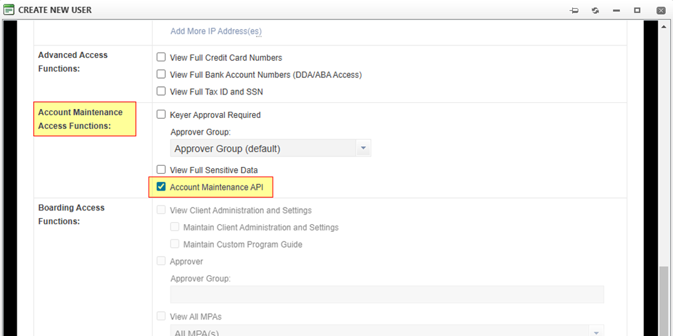

# AccessOne API User Setup Guide

## Procedures

Login as the primary OR admin user who already has the API enabled on their profile.

**For secondary users:** navigate to Admin > User Maint > Manage Users,

**For Sub-group, sub-client, MSA and SA:** navigate to Admin > User Maint > User List

**To create a new user:** Click "Create New User" button,

**To update/add API to an existing user:** Click User Name

## Reporting API

Check "Reporting API Access" under the "General Access Functions". AccessOne will generate a password, and you will be able to click on SHOW to view the AccessOne Common API Authentication (case sensitive) that you can incorporate in the API calls for that User Name.

Click **SUBMIT.**

## Boarding API

Boarding Access needs to be enabled under General Access Functions.

Scroll down to Boarding Access Functions and you can enable Boarding API Access for
your available platform (Omaha/North).

Click **SUBMIT.**

## Account Maintenance API

Account Maintenance Access needs to be enabled under General Access Functions.

Scroll down to Account Maintenance Access Functions and you can enable Account Maintenance API.

Click **SUBMIT.**

You will use the password shown under Common API Authentication in the General Access Functions for all API endpoints listed in Developer Studio.

